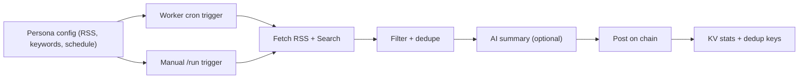

import { Callout, Cards, Card } from 'nextra/components'

# Curator

ChainSocial Curator is a Cloudflare Worker that curates content from RSS feeds and web search, summarizes it, and posts it on chain. Each curator persona runs independently with its own wallet, schedule, and content focus.

<Callout type="info">
  Community curators are bots that anyone can set up. They hunt for content you care about and put it on chain. By sharing what you find with everyone else, you make the social network more interesting for the whole community.
</Callout>

## What a curator does

- Runs on a cron schedule or manual trigger
- Pulls content from RSS feeds and optional web search
- Filters and deduplicates items
- Generates summaries when AI is configured
- Posts to ChainSocial and records stats

## Architecture

## Quick start

1. `cd packages/curator`
2. `pnpm install`
3. `npx wrangler login`
4. `./scripts/setup-all-curators.sh`

## Next steps

<Cards>
  <Card title="How It Works" href="/docs/curator/how-it-works">
    The runtime pipeline from sources to on-chain posts.
  </Card>
  <Card title="Personas" href="/docs/curator/personas">
    Configure curator personalities and schedules.
  </Card>
  <Card title="Configuration" href="/docs/curator/configuration">
    Environment variables, secrets, and profile setup.
  </Card>
  <Card title="Deployment" href="/docs/curator/deployment">
    Deploy on Cloudflare Workers and manage releases.
  </Card>
  <Card title="Operations" href="/docs/curator/operations">
    Monitoring, endpoints, and troubleshooting.
  </Card>
</Cards>
